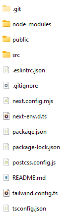
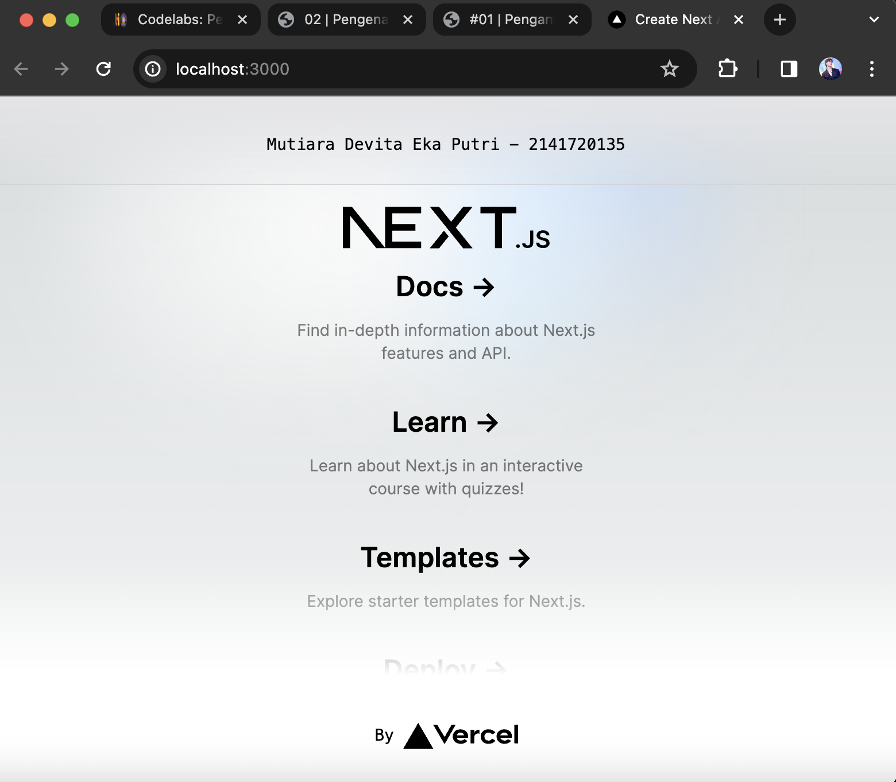

1. Apa yang dimaksud dengan :
a. TypeScript : TypeScript adalah sebuah bahasa pemrograman yang merupakan superset dari JavaScript. TypeScript memperluas fitur JavaScript dengan menambahkan tipe data statis opsional dan fitur modern lainnya untuk membantu dalam pengembangan aplikasi yang lebih besar dan kompleks.
b. ESLint : ESLint adalah alat linting untuk JavaScript. Ini digunakan untuk menganalisis kode JavaScript dan mengidentifikasi pola yang tidak diinginkan atau potensi masalah dalam kode. ESLint membantu menghasilkan kode JavaScript yang lebih bersih, konsisten, dan bebas dari kesalahan.
c. Tailwind CSS : Tailwind CSS adalah kerangka kerja CSS yang mengutamakan penggunaan menggunakan kelas-kelas bawaan Tailwind untuk membuat tata letak dan gaya yang cepat dan konsisten untuk membangun antarmuka pengguna.
d. App Router : App Router adalah komponen atau modul dalam pengembangan aplikasi web yang mengatur navigasi antar halaman atau rute dalam aplikasi. Ini memungkinkan pengguna untuk berpindah antara halaman atau bagian aplikasi dengan nyaman.
e. Import alias : Import alias adalah cara untuk memberikan nama alternatif atau singkat pada modul yang diimpor dalam JavaScript atau TypeScript. Ini membantu dalam mengurangi panjang kode dan meningkatkan keterbacaan dengan mengganti nama modul yang panjang dengan alias yang lebih ringkas.

2. Pada struktur project tersebut, jelaskan kegunaan folder dan file masing-masing tersebut!

Jawab :
a. Folder:
.git: Menyimpan metadata dan riwayat perubahan kode project.
node_modules: Menyimpan dependensi Node.js yang digunakan project.
public: Menyimpan file statis seperti gambar, CSS, dan JavaScript yang akan diakses langsung oleh browser.
src: Menyimpan kode sumber project, termasuk komponen React, halaman, dan API.

b. File:
.eslintrc.json: Menyimpan konfigurasi ESLint untuk linting kode JavaScript.
.gitignore: Menyimpan daftar file yang tidak ingin dilacak oleh Git.
next.config.mjs: Menyimpan konfigurasi Next.js untuk project.
next-env.d.ts: Menyimpan deklarasi tipe TypeScript untuk variabel lingkungan Next.js.
package.json: Menyimpan informasi tentang project, termasuk dependensi dan skrip.
package-lock.json: Menyimpan daftar dependensi yang diinstal dan versi spesifiknya.
postcss.config.js: Menyimpan konfigurasi PostCSS untuk memproses CSS.
README.md: Menyimpan deskripsi project.
tailwind.config.ts: Menyimpan konfigurasi Tailwind CSS untuk project.
tsconfig.json: Menyimpan konfigurasi TypeScript untuk project.

3. Gantilah teks pada bagian atas dengan Nama - NIM Anda.
Jawab :
